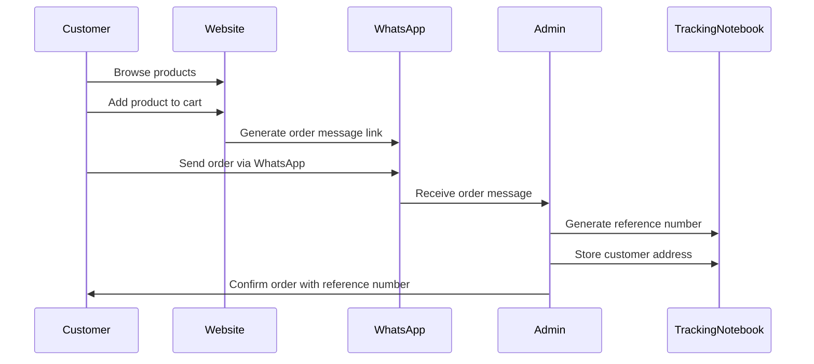

# 🛍️ DBless Multilingual eCommerce Website via WhatsApp

This project is a **database-free eCommerce site generator** that uses **WhatsApp** for handling customer orders and communication. It supports **multiple languages**, with each language version hosted on a separate GitHub Pages subdomain via **Git submodules**.

---

## 🌐 Key Features

- ✅ **No database needed** — Orders are placed via WhatsApp, avoiding complex data compliance issues.
- 🌍 **Multilingual support** — Turkish (`tr`), Arabic (`ar`), and English (`en`) versions managed through Git submodules.
- ⚙️ **Automated site generation** — Run a script to rebuild and deploy all language sites in one go.
- 🗂️ **Clean, structured repo** — Uses centralized JSON files and organized folders for data and images.

---

## 📁 Project Structure

```plaintext
SITE-GENERATOR/
├── generate-all.sh              # Main generation script
├── files/                       # Static assets used by the generated sites
│   ├── css/                     # Global CSS styles
│   ├── img/                     # Images and icons
│   └── js/                      # JavaScript files
│
├── scripts/                     # All automation scripts
│   ├── generators/              # Generators for specific content
│   │   ├── html-generators.sh   # Generates HTML pages
│   │   └── product-generators.sh# Generates product-related pages/content
│   │
│   ├── tasks/                   # Utility tasks for building assets
│   │   ├── copy-images.sh       # Copies images to the build folder
│   │   ├── create-css.sh        # Builds/merges CSS files
│   │   ├── create-pages.sh      # Creates static pages
│   │   ├── create-products.sh   # Creates product pages
│   │   └── merge-js.sh          # Merges and processes JS functionality
│   │
│   └── utils/                   # Helper functions for scripts
│       └── utils.sh             # Common shell utilities
│       └── push-sites.sh        # Deploy/push sites to the server or repo
│
├── site-ar/                     # Generated site content in Arabic
├── site-en/                     # Generated site content in English
├── site-tr/                     # Generated site content in Turkish
│
└── .editorconfig                # Editor configuration for consistent coding style
└── .gitmodules                  # Git submodules configuration
```

---

## 🔄 How It Works

### 🧩 Language Submodules

Each language version is a separate GitHub repository, added as a Git submodule to this main generator repo.

- Host different language sites at different subdomains (`tr.example.com`, `en.example.com`, etc.)
- Manage content in isolation while sharing a common structure.

📖 [Learn more about Git Submodules](https://git-scm.com/book/en/v2/Git-Tools-Submodules)

⚠️ **Why initialize submodules?**  
Because the language folders (`site-ar`, `site-en`, `site-tr`) are *not* regular folders but linked repositories.  
Without initializing, they will be empty placeholders.

```bash
git submodule update --init --recursive
```

📖 [GitHub Pages documentation](https://docs.github.com/en/pages)

---

## 🛒 Order Flow



---

## 📝 Managing Page Content

All text and configuration for each language site are stored in the `data/site.json` file inside the respective language folder (`site-ar`, `site-en`, `site-tr`).

- **Static text** (homepage content, about page, etc.) is stored as key/value pairs.
- **Images** are stored in `files/img/` and referenced in JSON files.
- **Admin editing**: These JSON files can be updated directly in GitHub, or through a planned admin interface for non-technical editors.

---

## 📒 Order Tracking Notebook

For every order:

1. The admin assigns a **Reference Number** to the customer’s address in chat.
2. The customer’s **address** and order details are stored in a simple tracking notebook (JSON or CSV) for future reference and repeat sales.

Example structure (`tracking-notebook.json`):

```json
[
  {
    "referenceNumber": "REF-20250805-01",
    "customerName": "Ali Ahmad",
    "address": "Gaza City, Palestine",
    "orderDetails": [
      {"productId": "p500", "quantity": 2}
    ],
    "status": "Pending"
  }
]
```

---

## 💰 Product Price & Shipping Cost

- **Current prices** are stored in `product.json` for each language site.
- **Shipping costs** are stored in `data/shipping.json` in each language site.

Since these values change frequently, maintain a **history** in a separate file:

Example (`price-history.json`):

```json
[
  {
    "productId": "p500",
    "date": "2025-08-01",
    "price": 210,
    "shippingCost": 20
  }
]
```

This allows you to track changes over time and adjust pricing easily.

---

## ➕ Adding New Content

### 🆕 Product JSON Structure

```jsonc
{
  "id": "p500",
  "name": "Erzincan Tulum",
  "url": "erzincan-tulum",
  "price": 210,
  "currency": "USD",
  "shortDesc": "Short desc",
  "metaDesc": "Meta desc",
  "keywords": "cheese, organic",
  "image": "/static/img/products/erzincan-tulum.jpg",
  "weight": "500g",
  "category": "cheese",
  "featured": true,
  "inStock": true
}
```

Add your product in `site-<lang>/data/product.json` then run:

```bash
./generate-all.sh
```

---

### 🌍 Add a New Language

1. Create a new repo for the language (e.g., `site-fr`).
2. Add it as a submodule:
```bash
git submodule add <repo-url> site-fr
```
3. Create the data/ folder inside the new language repo and add the required JSON files.
4. Translate content in the JSON files to the new language.
5. Run the generator script to build the site:
```bash
./generate-all.sh
```

---

### 📄 Add a New Page

1. Update `site-<lang>/data/site.json`
2. Add a new page entry
3. Run:
```bash
./scripts/tasks/create-pages.sh
```

---

## 🚀 Build & Deploy in One Step

Instead of running separate generate and deploy commands, use:

```bash
./scripts/utils/push-sites.sh
```

This will generate all sites and deploy them to their respective submodules in one go.

---

## 🛠️ Development Setup

Clone the repo and initialize submodules:

```bash
git clone <repo-url>
cd site-generator
git submodule update --init --recursive
```

After making changes to JSON files or static content:

```bash
./generate-all.sh
```

---

## 🪪 License

This project is licensed under the [MIT License](./LICENSE).

---

## 📬 Contributions

Feel free to open issues or PRs to improve the generator or add new features.
