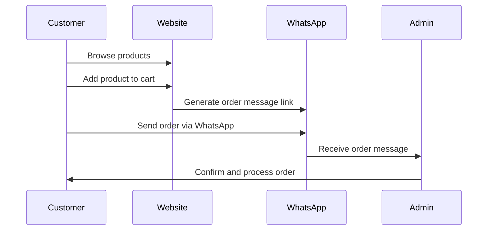

# 🛍️ DBless Multilingual eCommerce Website via WhatsApp

This project is a **database-free eCommerce site generator** that uses **WhatsApp** for handling customer orders and communication. It supports **multiple languages**, with each language version hosted on a separate GitHub Pages subdomain via **Git submodules**.

---

## 🌐 Key Features

- ✅ **No database needed** — Orders are placed via WhatsApp, avoiding complex data compliance issues.
- 🌍 **Multilingual support** — Turkish (`tr`), Arabic (`ar`), and English (`en`) versions managed through Git submodules.
- ⚙️ **Automated site generation** — Run a script to rebuild and deploy all language sites in one go.
- 🗂️ **Clean, structured repo** — Uses centralized JSON files and organized folders for data and images.

---

## 📁 Project Structure

```plaintext
SITE-GENERATOR/
├── files/                       # Static assets used by the generated sites
│   ├── css/                     # Global CSS styles
│   ├── img/                     # Images and icons
│   └── js/                      # JavaScript files
│
├── scripts/                     # All automation scripts
│   ├── core/                    # Core scripts to build & deploy sites
│   │   ├── generate.sh          # Main generation script
│   │   └── push-sites.sh        # Deploy/push sites to the server or repo
│   │
│   ├── generators/              # Generators for specific content
│   │   ├── html-generators.sh   # Generates HTML pages
│   │   └── product-generators.sh# Generates product-related pages/content
│   │
│   ├── tasks/                   # Utility tasks for building assets
│   │   ├── copy-images.sh       # Copies images to the build folder
│   │   ├── create-css.sh        # Builds/merges CSS files
│   │   ├── create-pages.sh      # Creates static pages
│   │   ├── create-products.sh   # Creates product pages
│   │   └── merge-js.sh          # Merges and processes JS functionality
│   │
│   └── utils/                   # Helper functions for scripts
│       └── utils.sh             # Common shell utilities
│
├── site-ar/                     # Generated site content in Arabic
├── site-en/                     # Generated site content in English
├── site-tr/                     # Generated site content in Turkish
│
└── .editorconfig                # Editor configuration for consistent coding style
└── .gitmodules                  # Git submodules configuration
```

---

## 🔄 How It Works

### 🧩 Language Submodules

Each language version is a separate GitHub repository, added as a Git submodule to this main generator repo.

- Host different language sites at different subdomains (`tr.example.com`, `en.example.com`, etc.)
- Manage content in isolation while sharing a common structure.

📖 [Learn more about Git Submodules](https://git-scm.com/book/en/v2/Git-Tools-Submodules)

⚠️ **Why initialize submodules?**  
Because the language folders (`site-ar`, `site-en`, `site-tr`) are *not* regular folders but linked repositories.  
Without initializing, they will be empty placeholders.

```bash
git submodule update --init --recursive
```

📖 [GitHub Pages documentation](https://docs.github.com/en/pages)

---

## 🛒 Order Flow



---

## ➕ Adding New Content

### 🆕 Product JSON Structure

```jsonc
{
  "id": "p500",                 // Unique product ID
  "name": "Erzincan Tulum",     // Product name
  "url": "erzincan-tulum",      // URL slug
  "price": 210,                 // Price
  "currency": "USD",            // Currency code
  "shortDesc": "Short desc",    // Short description for cards
  "metaDesc": "Meta desc",      // SEO meta description
  "keywords": "cheese, organic",// SEO keywords
  "image": "/static/img/products/erzincan-tulum.jpg", // Main image path
  "weight": "500g",             // Weight or package size
  "category": "cheese",         // Product category
  "featured": true,             // Show on homepage?
  "inStock": true               // Availability
}
```

Add your product in `site-<lang>/data/product.json` then run:

```bash
./scripts/core/generate.sh
```

---

### 🌍 Add a New Language

1. Create a new repo for the language (e.g., `site-fr`).
2. Add it as a submodule:
```bash
git submodule add <repo-url> site-fr
```
3. Create the data/ folder inside the new language repo and add the required JSON files:
site-fr/
└── data/
    ├── company.json    # Company/site metadata
    ├── site.json       # General site configuration
    └── product.json    # Product listings

4. Translate content in the JSON files to the new language.

5. Run the generator script to build the site:

```bash
./scripts/core/generate.sh
```
---

### 📄 Add a New Page

1. Update `site-<lang>/data/site.json`
2. Add a new page entry
3. Run:
```bash
./scripts/create-pages.sh
```

---

## 🚀 Generate & Deploy Sites

### 🔨 Generate Sites
```bash
./scripts/core/generate.sh
```
- Reads from `site.json`, `company.json`, and `product.json`
- Generates static pages for all languages.

### 📤 Deploy Sites
```bash
./scripts/core/push-sites.sh
```
- Commits and pushes updates to each submodule repo.

---

## 🛠️ Development Setup

Clone the repo and initialize submodules:

```bash
git clone <repo-url>
cd site-generator
git submodule update --init --recursive
```

After making changes to JSON files or static content:

```bash
./scripts/update.sh
```

---

## 🪪 License

This project is licensed under the [MIT License](./LICENSE).

---

## 📬 Contributions

Feel free to open issues or PRs to improve the generator or add new features.
